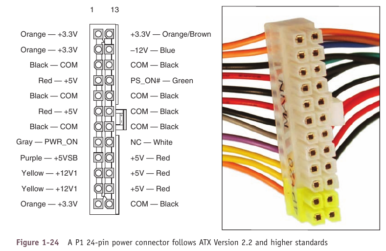

# Fuente

- [Fuente](#fuente)

---

## Cables

- 24-pin P1: para la motherboard.
- 20+4-pin P1: para la motherboard.
  - Los 4 extras proveen +12V, +5V y +3.3V.
- 4-pin 12-V: para el procesador.
- 8-pin 12-V: para el procesador.
- 4-pin Molex: para discos IDE y ventiladores. Provee +5V y +12V.
- 15-pin SATA power: para discos SATA. Provee +3.3V, +5V y +12V.
- PCIe 6-pin: para GPU. Provee +12V.
- PCIe 8-pin: para GPU. Provee +12V.
- PCIe 6/8-pin: para GPU. Provee +12V.

