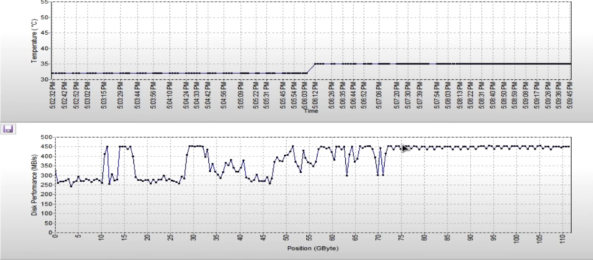
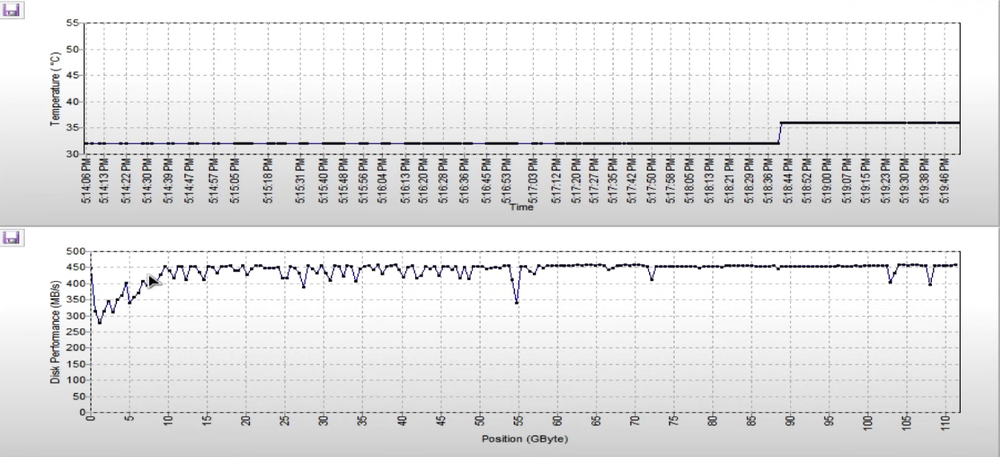
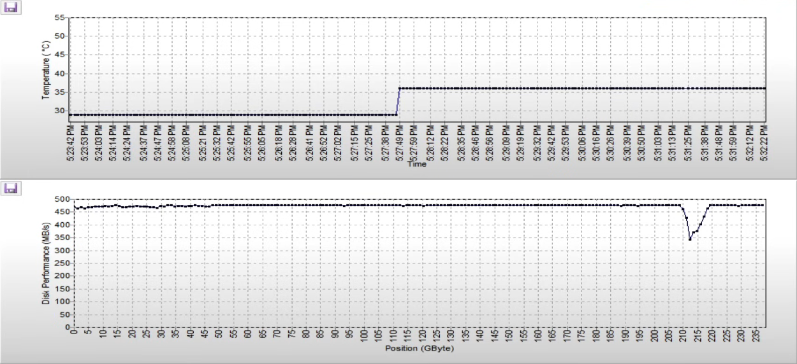

# Reparación de una PC

## [Se resetea o no bootea](https://youtu.be/UTZwOQMJp3o)

- Importante primero resguardar los datos por si es problema de disco.
- Se prueba primero el disco (post backup) y después la RAM.

1. Hacer backup de los datos:
   1. Iniciar con **Strelek** y una vez iniciado, enchufar un disco externo para el backup.
   2. Copiar los datos importantes de usuario al otro disco con Total Commander.
   3. Revisar estado las particiones con `chkdsk letra: /f`.
   4. Revisar disco en **CrystalDisk**
   5. Reiniciar.
2. Hacer imagen de ghost con **Symantec Ghost (No split image)**.
   1. Local > Disk > To Image. Seleccionar disco de origen y después destino. Mejor no guardar en el raiz, hacer una carpeta ahí. Comprimir imagen en modo Fast.
   2. Si hay problema de _bad blocks_ y se cierra, volver a hacer `chkdsk` por las dudas. También puede ser problema de memoria.
   3. Hacer escaneo de superficie con **Hard Disk Sentinel** e ir a _Temperature and transfer speed_.
   4. Revisar los sensores con **HWiNFO**.
   5. Reintentar paso 2.0.
3. Si los parpadeos del led frontal de disco no son uniformes o no es constante, al disco le está costando la lectura. Es posible que el disco esté haciendo trabajos internos después de la lectura con el **Sentinel**.
4. Reiniciar y hacer **MEMTEST** con singlecore. Si pasa el test 7, está ok.
   1. Si hay error de memoria: sacar, limpiar contactos y socket.
   2. Volver a poner y testear otra vez con singlecore. Si no hay problema esta vez, puede ser falso contacto.
   3. Una vez que esté bien la memoria, volver a hacer el paso 1.0.
5. Si se encontró el problema, es recomendable restaurar la copia en un nuevo disco. Luego de eso y comprobar que arranca con el disco nuevo, restaurar la copia en el disco original.
6. Hacer la prueba de superficie con **Sentinel**.
   1. Si el gráfico sube y baja, puede haber problema en el cable sata o el disco está degradado (antigüedad). Cambiar primero el cable sata.
   2. Si se mantiene el error en el gráfico, probar lo mismo con el disco nuevo con la imagen restaurada. Se busca la raya continua con menos alteraciones.

## [Refresco de superficie por clonado y backup](https://youtu.be/Vzb8uJ9KYVc)

- Se busca generar un backup y/o refrescar la superficie del SSD.
  - No es un método de backup.
- El proceso de refresco de superficie se da cuando Ghost hace TRIMM al clonar la imagen.
- Los SSD tienen ciclos de lectura/escritura, cuando se hace este proceso se está usando uno de los ciclos disponibles, así que hacer esto seguido puede degradar mas el disco. Se puede hacer una vez por año, o cada dos años.

1. Iniciar con un **Strelec**.
2. Insertar el disco externo para el backup.
3. Hacer imagen de ghost con **Symantec Ghost (No split image)** en modo Fast.
   1. Local > Disk > To Image. Seleccionar disco de origen y después destino. Mejor no guardar en el raiz, hacer una carpeta ahí. Comprimir imagen en modo Fast.
4. Hacer escaneo de superficie con **Hard Disk Sentinel** e ir a _Temperature and transfer speed_.
   1. Si el gráfico es inestable se recomienda hacer la restauración de la imagen en el mismo disco (la imagen del disco A restaurarla en el disco A) y volver a hacer la prueba. Se busca que el gráfico sea lo mas parejo.
5. A la imagen generada al final se recomienda hacer un archivo de comprobación sha256 o md5 y despues comprimir todo con 7Zip en Ultra, LZMA2, 256, 256, Solid Block Size mayor al tamaño de la imagen e ir subiendo los núcleos para la compresión según la ram disponible (no pasarse con la ram).

## [SSDs como saber si la data esta decayendo](https://youtu.be/Jrlla5dG72U)

- Es importante refrescar la superficie de los SSD.
- Un SSD no está pensado para dejarlo desenchufado mucho tiempo.

1. Iniciar con un **Strelec**.
2. Ir a **Diagnostics** > **Hard Disk Sentinel**.

   1. Seleccionar disco, hacer surface test de escritura e ir a _Temperature and transfer speed_.
   2. Un disco malo se ve así, con una raya dispareja:

      

   3. Un disco bueno se ve así, mas parejo:

      

      - La caida del principio es aceptable y suele pasar

   4. Un disco de marca, excelente, se ve así:

      

      - Esa caida seguramente es cerca de una zona dañada.

3. Después de probar y si el disco se ve degradado, se recomienda hacer el [refresco de superficie](#refresco-de-superficie-por-clonado-y-backup).
